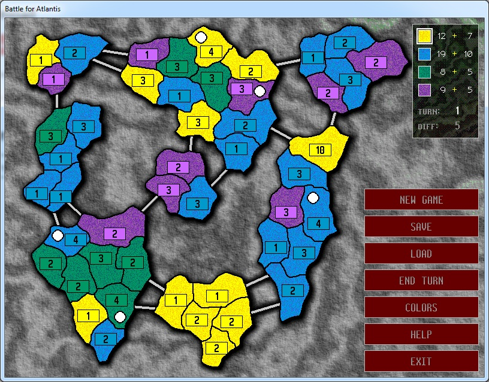

## Battle for Atlantis

## Notes

Hi!

I made this game orginally in Borland C++ 20 years ago (in 2001).
Inspired by William Soleau Battle for Atlantis.

I made some changes in a code after that, to compile it using VisualStudio 2019 (and earlier, previous VS versions).

After compiling, copy generated exe file to Game folder. Or run from Visual Studio.

You can download (for free) ready to play game from itch.io: [Battle for Atlantis on itch.io](https://pturecki.itch.io/battle-for-atlantis).

You can use, copy, modify etc this code as you wish.

Have fun!

## Folders structure

Main
- AtlantisSrc (source code, solution and project files)
- Game (game data files, without exe)
- Doc (image for this readme.dm file)
